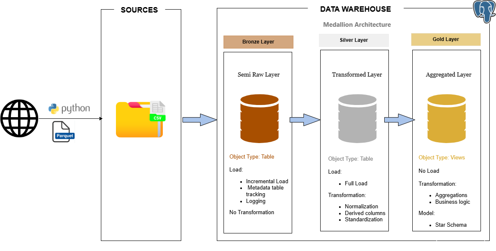

# NYC TAXI DATA PIPELINE

## Navigation / Quick Access
Quickly move to a section:
- [Overview](#overview)
- [Project Objective](#project-objective)
- [Project Architecture](#project-architecture)
- [Pipeline Flow and Logic](#pipeline-flow-and-logic)

---
## Overview
This project involves building an entire data pipeline in SQL that ingests, transforms, and aggregate. It demonstarate both Full refresh and Incremental load strategies into three layers of Medallion architecture:
- **Raw Layer (Bronze)**: Ingest data incrementally with metadata tracking from source
- **Transformed Layer (Silver)**: Full data loading from bronze layer: cleaning, transformation, normalization, and standardization
- **Aggregated Layer (Gold)**: Produces summarized and analytics ready data.

---
## Project Objective
The objective of this project is to design and implement a fully SQL-based ETL pipeline that automates data ingestion, transformation, and aggregation for the **NYC Taxi 2024 dataset**. 

The pipeline demonstrates both **full refresh** and **incremental loading** strategies within the Medallion Architecture framework, ensuring efficient, scalable, and idempotent data processing.

Specifically, the project aims to:
- Implement an **automated ingestion process** that loads monthly trip data incrementally into the Raw (Bronze) layer and full load into the Transformed (Silver) layer.
- Build a **metadata table** to track load history and prevent duplicate inserts.
- Transform raw data into standardized, cleaned formats in the **Silver** layer using partitioned tables.
- Aggregate and summarize data in the **Gold** layer for analytical and reporting purposes.
- Deliver comprehensive **SQL scripts** and a **pipeline architecture diagram** demonstrating data flow across all layers.

---
## Project Architecture

The diagram illustrates data movement across the layers. The pipeline follows the Medallion Architecture pattern to enable scalable and modular data processing.

- **Bronze Layer**: Raw incremental ingestion load from external sources; metadata table; minimal transformation.
- **Silver Layer**: Full load; Cleansed, standardized, and partitioned tables for analytics.
- **Gold Layer**: Aggregated and business-ready datasets for reporting.

---
## Pipeline Flow and Logic

### Metadata Management
The metadata table (`meta.load_metadata`) was created to dynamically tracks:
- `file_name`: File name processed
- `no_of_rows_inserted`: Number of rows ingested after process
- `last_dropoff_datetime`: store last successful load date of ingested file
- `status` (**success**, **failed**, **skipped**)
- `load_timestamp`: Timestamp of when the file was processed and ingested

### Incremental Load
This part is the key highlight of the project data pipeline. It ensures that no already processed or ingested file gets re-run by using a metadata table to dynamically track file processing and ingestion — in short, it makes the pipeline **idempotent** (the pipeline produces the same result no matter how many times it’s run). Incremental ingestion is handled by a stored procedure that:
1. **Parses period from the file name** (e.g., `2024-07`) and computes a month window
`month_start = 2024-07-01 00:00:00`, `month_end = 2024-08-01 00:00:00`
2. **Stages the file** into a temporary table shaped like the Bronze table. The temp table is truncated each run.
3. **Period-based filtering**: Inserts only rows whose `tpep_dropoff_datetime` falls within [month_start, month_end] - This prevents stray/out-of-range records from affecting later loads.
4. **Idempotency check via metadata**
Before inserting, the procedure checks the metadata table for this file/period:
    - If already loaded -> **status** = `skipped`, 0 rows
    - Else -> proceed with the insert
5. **Accurate load accounting & logging**
After insert, the procedure records in `meta.load_metadata`:
    - `file_name` (last part of file name)
    - `no_of_rows_inserted` (rows inserted within the month window)
    - `last_dropoff_datetime` (max within bronze layer after ingestion)
    - `status`
    - `load_timestamp` (current timestamp of ingestion)
    
This design avoids timestamp drift, supports safe re-runs, and keeps a clear audit trail of every monthly file processed.
